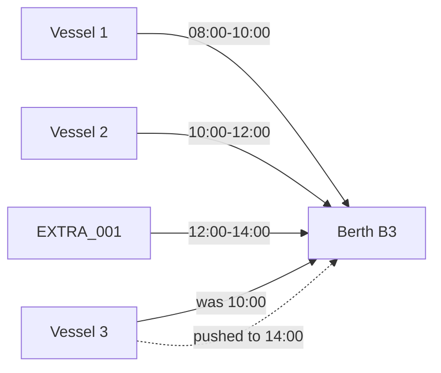

# Feature 4: Knowledge Graph + CP-SAT Optimization

## Overview

Feature 4 provides intelligent berth assignment optimization for Tallinn Port using:
- **Neo4j Knowledge Graph** for real-time port state management
- **CP-SAT Solver** (Google OR-Tools) for constraint-based optimization
- **Cascade Explanation** showing downstream impacts of scheduling decisions

---

## Implementation Phases

### Phase 1: Knowledge Graph Setup ✅
| Component | Description |
|-----------|-------------|
| Neo4j Database | Graph database for port entities |
| Schema | Vessel, Berth, Asset, Zone, Plan nodes |
| Constraints | Unique IDs for MMSI, berth_id, asset_id |

### Phase 2: AIS Data Integration ✅
| Component | Description |
|-----------|-------------|
| Live Stream | WebSocket connection to AISStream |
| Zone Classification | APPROACH → ANCHORAGE → BERTH flow |
| ETA Estimation | Distance-based arrival time calculation |

### Phase 3: Port Inventory ✅
| Asset | Count | Details |
|-------|-------|---------|
| Berths | 4 | B1-B2 (Old City), B3-B4 (Muuga) |
| Cranes | 6 | 2 per container berth |
| Yard Blocks | 3 | 10,000 TEU total capacity |

### Phase 4: CP-SAT Optimizer ✅
| Component | Description |
|-----------|-------------|
| Decision Variables | Vessel-berth assignments, start/end times |
| Constraints | Capacity, no-overlap, service time |
| Objective | Minimize weighted delay + congestion |

### Phase 5: API Integration ✅
| Endpoint | Purpose |
|----------|---------|
| `POST /optimizer/scenario` | Create optimization scenario |
| `POST /optimizer/run` | Execute CP-SAT solver |
| `GET /plans/{plan_id}` | Get plan with assignments |
| `GET /kg/cascade/{plan_id}` | Get cascade visualization |

---

## CP-SAT Solver Explained

### What is CP-SAT?

**Constraint Programming with SAT** (Boolean Satisfiability) is a hybrid optimization technique that:
1. Models problems using **integer variables** and **constraints**
2. Combines constraint propagation with SAT solving
3. Finds optimal or near-optimal solutions efficiently

### Why CP-SAT vs Machine Learning?

| Aspect | CP-SAT | Machine Learning |
|--------|--------|------------------|
| Training Data | ❌ Not required | ✅ Required |
| Explainability | ✅ Fully explainable | ⚠️ Black box |
| Guarantees | ✅ Optimal solution | ❌ Approximate |
| Runtime | Fast (seconds) | Varies |

---

## Optimization Model

### Decision Variables

```python
# For each vessel v and berth b:
assign[v, b]  # Binary: 1 if vessel v assigned to berth b
start[v]      # Integer: start time in minutes from now
end[v]        # Integer: end time in minutes from now
delay[v]      # Integer: delay from original ETA
```

### Constraints

| Constraint | Description | Formula |
|------------|-------------|---------|
| **One Berth** | Each vessel assigned to exactly one berth | `Σ assign[v,b] = 1` for each v |
| **No Overlap** | Vessels at same berth don't overlap | If both at berth b: `end[v1] ≤ start[v2]` OR `end[v2] ≤ start[v1]` |
| **Service Time** | Time = containers ÷ (crane_count × rate) | `end[v] = start[v] + service_time[v,b]` |
| **ETA Respect** | Cannot start before arrival | `start[v] ≥ eta[v]` |
| **Delay Calc** | Delay from original ETA | `delay[v] = start[v] - eta[v]` |

### Objective Function

Minimize weighted sum:
```
Minimize: 0.40 × Total Delay
        + 0.25 × Congestion Penalty
        + 0.20 × Operating Cost
        + 0.15 × Priority Violation
```

| Weight | Factor | Why |
|--------|--------|-----|
| 40% | Delay | Primary goal: minimize vessel waiting |
| 25% | Congestion | Spread load across berths |
| 20% | Cost | Prefer efficient berth-vessel matches |
| 15% | Priority | High-priority cargo (pharma > general) |

---

## Cascade Explanation

When an extra vessel is inserted, the optimizer shows **cascade impacts**:

```
Berth B3 occupied by MMSI 276482000 until 14:30 → your start pushed to 15:00
```

### How Cascades Work



Each delayed vessel gets a **reason** explaining which upstream vessel caused its delay.

---

## API Usage Example

```bash
# 1. Create scenario with extra vessel
POST /optimizer/scenario
{
  "extra_vessel": {
    "eta": "2026-01-31T10:00:00Z",
    "containers_est": 200,
    "cargo_priority": "pharma"
  }
}
# Returns: scenario_id = "abc123"

# 2. Run optimization
POST /optimizer/run?scenario_id=abc123
# Returns: 3 plans ranked by objective score

# 3. Get cascade visualization
GET /kg/cascade/plan_1
# Returns: berth timeline + cascade impacts
```

---

## Files Reference

| File | Purpose |
|------|---------|
| `services/kg/optimizer.py` | CP-SAT model and solver |
| `services/kg/api.py` | FastAPI endpoints |
| `services/kg/neo4j_client.py` | Neo4j database operations |
| `services/kg/config.py` | Port inventory configuration |
| `services/kg/zones.py` | Zone classification logic |
| `services/ais_ingestion/app.py` | Live AIS data streaming |
